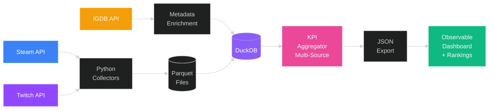
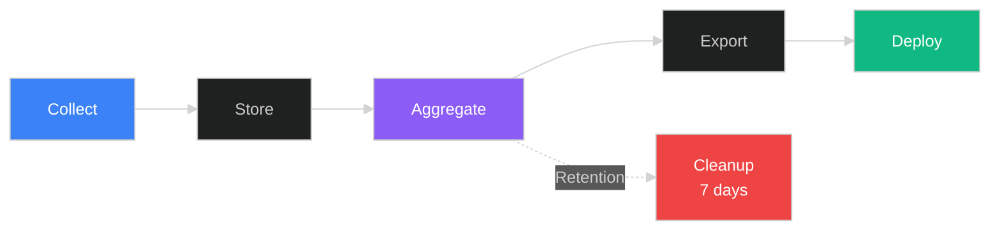
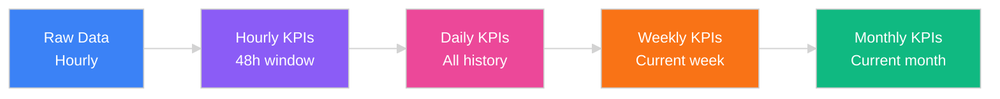

# About This Project

## Project Vision

The **Gaming Data Observatory** is a comprehensive data engineering portfolio demonstrating **end-to-end data pipeline architecture**, from automated hourly data collection to interactive visualization. This project showcases industry best practices in data engineering, MLOps, and DevOps.

**Key Highlights:**

- **Multi-source data collection** from Steam and Twitch APIs via GitHub Actions
- **Multi-scale aggregation** (hourly, daily, weekly, monthly KPIs) per source
- **Modern data stack** with DuckDB, Parquet, and Observable Framework
- **Interactive rankings** with platform selector (Steam/Twitch) and time range filters
- **Dynamic game pages** with dual charts (Steam players + Twitch viewers)
- Test-driven development with 80%+ code coverage
- Optimized for performance with incremental updates and efficient storage

---

## System Architecture



**Data Flow:**
1. **Steam API** provides real-time player statistics (CCU, peak CCU)
2. **Twitch API** provides viewership data (viewers, channels streaming)
3. **IGDB API** enriches game metadata (genres, themes, ratings, cover images)
4. **Python Collectors** fetch data with rate limiting and error handling
5. **Parquet Files** store raw time-series data (partitioned by date/source/game)
6. **DuckDB** enables analytical queries with SQL and ACID transactions
7. **KPI Aggregator** calculates multi-scale metrics per source (daily → weekly → monthly)
8. **JSON Export** optimizes data for web consumption with server-side filtering
9. **Observable Dashboard** provides interactive rankings and game pages

---

## Data Pipeline



**Pipeline Stages:**

1. **Discovery** (On demand) - Discover and enrich game metadata from IGDB API
2. **Collection** (Every hour) - Fetch Steam player counts and Twitch viewership data with rate limiting
3. **Storage** (Immediate) - Save to partitioned Parquet files and insert into DuckDB per source
4. **Aggregation** (Hourly) - Calculate KPIs per source at multiple time scales (daily → weekly → monthly)
5. **Cleanup** (Automatic) - Remove raw data older than 7 days, keep aggregated KPIs indefinitely
6. **Export** (After aggregation) - Generate optimized JSON files per source (Steam/Twitch/Unified)
7. **Deployment** (Automatic) - Build static site with Observable Framework and deploy to GitHub Pages

---

## Technology Stack

```js
html`<div class="tech-stack">
  <!-- Backend Technologies -->
  <div class="stack-section">
    <h3 class="stack-title">Backend & Data</h3>
    <div class="tech-grid">

      <div class="tech-card">
        <div class="tech-icon">
          
        </div>
        <div class="tech-content">
          <h4>Python 3.13</h4>
          <p class="tech-role">Data collection, processing & orchestration</p>
          <ul class="tech-features">
            <li>Rich ecosystem (pandas, requests, pytest)</li>
            <li>Type hints & async support</li>
            <li>Excellent tooling & community</li>
          </ul>
        </div>
      </div>

      <div class="tech-card">
        <div class="tech-icon">
          <svg viewBox="0 0 24 24" xmlns="http://www.w3.org/2000/svg">
            <circle cx="12" cy="12" r="10" fill="#FFF000"/>
            <ellipse cx="10" cy="10" rx="1.5" ry="1" fill="#000"/>
            <ellipse cx="14" cy="10" rx="1.5" ry="1" fill="#000"/>
            <path d="M8 13 Q12 15 16 13" stroke="#FF6B00" stroke-width="1.5" fill="none" stroke-linecap="round"/>
            <path d="M16 8 Q18 6 20 8" stroke="#FF6B00" stroke-width="1.5" fill="none" stroke-linecap="round"/>
          </svg>
        </div>
        <div class="tech-content">
          <h4>DuckDB</h4>
          <p class="tech-role">Embedded analytical database (OLAP)</p>
          <ul class="tech-features">
            <li>Columnar storage optimized for analytics</li>
            <li>Native Parquet support (zero-copy reads)</li>
            <li>ACID transactions with PRIMARY KEY</li>
            <li>No server needed, runs in-process</li>
          </ul>
        </div>
      </div>

      <div class="tech-card">
        <div class="tech-icon">
          <svg viewBox="0 0 24 24" fill="none" xmlns="http://www.w3.org/2000/svg">
            <rect x="3" y="3" width="18" height="18" rx="2" fill="#50ABF1"/>
            <path d="M8 8h8v2H8V8zm0 4h8v2H8v-2zm0 4h5v2H8v-2z" fill="white"/>
          </svg>
        </div>
        <div class="tech-content">
          <h4>Apache Parquet</h4>
          <p class="tech-role">Columnar storage for time-series data</p>
          <ul class="tech-features">
            <li>70% compression ratio vs CSV</li>
            <li>Fast columnar reads for analytics</li>
            <li>Partition pruning (date/game_id)</li>
            <li>Schema evolution support</li>
          </ul>
        </div>
      </div>

    </div>
  </div>

  <!-- Testing & Quality -->
  <div class="stack-section">
    <h3 class="stack-title">Testing & Quality</h3>
    <div class="tech-grid">

      <div class="tech-card">
        <div class="tech-icon">
          
        </div>
        <div class="tech-content">
          <h4>Pytest + Coverage</h4>
          <p class="tech-role">Unit & integration testing</p>
          <ul class="tech-features">
            <li>80%+ code coverage enforced</li>
            <li>Mocking external APIs</li>
            <li>TDD approach for all features</li>
          </ul>
        </div>
      </div>

      <div class="tech-card">
        <div class="tech-icon">
          <svg viewBox="0 0 24 24" fill="#000" xmlns="http://www.w3.org/2000/svg">
            <rect width="24" height="24" rx="4" fill="#000"/>
            <text x="12" y="17" font-size="16" font-weight="bold" fill="#fff" text-anchor="middle">B</text>
          </svg>
        </div>
        <div class="tech-content">
          <h4>Black + Ruff</h4>
          <p class="tech-role">Code formatting & linting</p>
          <ul class="tech-features">
            <li><strong>Black:</strong> Uncompromising formatter</li>
            <li><strong>Ruff:</strong> 10-100x faster than Flake8</li>
            <li>Zero configuration needed</li>
          </ul>
        </div>
      </div>

      <div class="tech-card">
        <div class="tech-icon">
          
        </div>
        <div class="tech-content">
          <h4>Mypy</h4>
          <p class="tech-role">Static type checking</p>
          <ul class="tech-features">
            <li>Catch bugs before runtime</li>
            <li>Type hints enforcement</li>
            <li>Early error detection</li>
          </ul>
        </div>
      </div>

    </div>
  </div>

  <!-- Frontend Technologies -->
  <div class="stack-section">
    <h3 class="stack-title">Frontend & Visualization</h3>
    <div class="tech-grid">

      <div class="tech-card">
        <div class="tech-icon">
          <svg viewBox="0 0 24 24" xmlns="http://www.w3.org/2000/svg">
            <circle cx="12" cy="12" r="10" fill="#4269D0"/>
            <circle cx="12" cy="12" r="6" fill="#fff"/>
            <circle cx="12" cy="12" r="3" fill="#4269D0"/>
          </svg>
        </div>
        <div class="tech-content">
          <h4>Observable Framework</h4>
          <p class="tech-role">Static site generator for data apps</p>
          <ul class="tech-features">
            <li>Reactive data loading</li>
            <li>Markdown + JavaScript authoring</li>
            <li>Hot reload & code splitting</li>
            <li>Dynamic page generation</li>
          </ul>
        </div>
      </div>

      <div class="tech-card">
        <div class="tech-icon">
          <svg viewBox="0 0 24 24" xmlns="http://www.w3.org/2000/svg">
            <rect width="24" height="24" fill="#4269D0"/>
            <path d="M6 18L12 6L18 18H6Z" fill="#fff"/>
            <circle cx="12" cy="14" r="2" fill="#4269D0"/>
          </svg>
        </div>
        <div class="tech-content">
          <h4>Plot.js</h4>
          <p class="tech-role">Declarative data visualization</p>
          <ul class="tech-features">
            <li>Declarative API (what, not how)</li>
            <li>Automatic scales & axes</li>
            <li>Responsive by default</li>
            <li>Rich mark types (line, area, dot...)</li>
          </ul>
        </div>
      </div>

    </div>
  </div>

  <!-- DevOps & CI/CD -->
  <div class="stack-section">
    <h3 class="stack-title">DevOps & CI/CD</h3>
    <div class="tech-grid">

      <div class="tech-card">
        <div class="tech-icon">
          
        </div>
        <div class="tech-content">
          <h4>GitHub Actions</h4>
          <p class="tech-role">Workflow automation & CI/CD</p>
          <ul class="tech-features">
            <li>Hourly data collection</li>
            <li>PR testing & coverage checks</li>
            <li>Automated deployment to Pages</li>
            <li>Native GitHub integration</li>
          </ul>
        </div>
      </div>

      <div class="tech-card">
        <div class="tech-icon">
          <svg viewBox="0 0 24 24" xmlns="http://www.w3.org/2000/svg">
            <rect width="24" height="24" rx="4" fill="#DE5FE9"/>
            <text x="12" y="17" font-size="14" font-weight="bold" fill="#fff" text-anchor="middle">uv</text>
          </svg>
        </div>
        <div class="tech-content">
          <h4>UV Package Manager</h4>
          <p class="tech-role">Fast Python package installer</p>
          <ul class="tech-features">
            <li>10-100x faster than pip</li>
            <li>Reproducible builds (lock files)</li>
            <li>Cross-platform compatibility</li>
          </ul>
        </div>
      </div>

    </div>
  </div>
</div>`
```

---

## KPI Calculation

### Multi-Scale Aggregation Hierarchy



**Incremental Update Strategy:**

| Level | Update Scope | Retention | Benefit |
|-------|--------------|-----------|---------|
| Hourly | Last 48 hours | 7 days | Real-time monitoring |
| Daily | Current day only | Indefinite | Historical analysis |
| Weekly | Current week only | Indefinite | Trend detection |
| Monthly | Current month only | Indefinite | Long-term patterns |

This strategy ensures **efficient processing** (no full table scans), **maintains data integrity** (immutable history), and **optimizes storage** (95% reduction vs keeping all raw data).

---

## Tracked Metrics

### Steam Player Metrics

| Metric | Description | Calculation | Use Case |
|--------|-------------|-------------|----------|
| **Peak CCU** | Maximum concurrent players | `MAX(player_count)` | Identify peak activity periods |
| **Average CCU** | Mean player count | `AVG(player_count)` | Understand typical engagement |
| **All-Time Peak** | Historical maximum | `MAX(peak_ccu)` | Track game popularity records |

### Twitch Viewership Metrics

| Metric | Description | Calculation | Use Case |
|--------|-------------|-------------|----------|
| **Peak Viewers** | Maximum concurrent viewers | `MAX(viewers)` | Identify peak streaming periods |
| **Average Viewers** | Mean viewer count | `AVG(viewers)` | Understand streaming popularity |
| **Average Channels** | Mean active streams | `AVG(channels)` | Track content creator interest |
| **All-Time Peak Viewers** | Historical maximum | `MAX(peak_viewers)` | Track streaming records |

### Game Metadata (IGDB + Steam)

| Category | Fields | Source | Description |
|----------|--------|--------|-------------|
| **Basic Info** | Name, Summary, Description | IGDB + Steam | Core game identification |
| **Publishing** | Developers, Publishers, Release Date | IGDB + Steam | Development details |
| **Platform** | Windows, macOS, Linux, Console | IGDB | Supported platforms |
| **Classification** | Genres, Themes, Tags | IGDB + Steam | Game categorization |
| **Visual Assets** | Cover Images, Screenshots | IGDB | Visual presentation |
| **Ratings** | IGDB Rating, Aggregated Rating | IGDB | Community scores |
| **Pricing** | Price, Free-to-play Status | Steam | Monetization model |

---

## Best Practices Demonstrated

```js
html`<div class="best-practices">
  <div class="practices-grid">

    <!-- Data Engineering -->
    <div class="practice-card">
      <div class="practice-icon" style="background: linear-gradient(135deg, #3b82f6, #1d4ed8);">
        <svg viewBox="0 0 24 24" fill="none" stroke="white" stroke-width="2" xmlns="http://www.w3.org/2000/svg">
          <rect x="3" y="4" width="18" height="16" rx="2"/>
          <line x1="3" y1="9" x2="21" y2="9"/>
          <line x1="3" y1="14" x2="21" y2="14"/>
          <line x1="9" y1="9" x2="9" y2="20"/>
          <line x1="15" y1="9" x2="15" y2="20"/>
        </svg>
      </div>
      <div class="practice-content">
        <h4>Data Engineering</h4>
        <ul class="practice-list">
          <li>Separation of concerns (collectors, processors, storage)</li>
          <li>Idempotent operations (safe to re-run)</li>
          <li>Incremental processing (efficient resources)</li>
          <li>Data retention policies (cost optimization)</li>
          <li>Schema evolution support (backward compatibility)</li>
        </ul>
      </div>
    </div>

    <!-- Software Engineering -->
    <div class="practice-card">
      <div class="practice-icon" style="background: linear-gradient(135deg, #8b5cf6, #6d28d9);">
        <svg viewBox="0 0 24 24" fill="none" stroke="white" stroke-width="2" xmlns="http://www.w3.org/2000/svg">
          <rect x="3" y="4" width="18" height="16" rx="2"/>
          <path d="M7 9l3 3-3 3" stroke-width="2" stroke-linecap="round" stroke-linejoin="round"/>
          <line x1="12" y1="15" x2="16" y2="15" stroke-linecap="round"/>
        </svg>
      </div>
      <div class="practice-content">
        <h4>Software Engineering</h4>
        <ul class="practice-list">
          <li><strong>80%+ test coverage</strong> (enforced by pre-commit)</li>
          <li>Test-driven development (write tests first)</li>
          <li>Type hints & static analysis (catch bugs early)</li>
          <li>Conventional commits (clear change history)</li>
          <li>Clean code principles (readable, maintainable)</li>
        </ul>
      </div>
    </div>

    <!-- DevOps -->
    <div class="practice-card">
      <div class="practice-icon" style="background: linear-gradient(135deg, #10b981, #059669);">
        <svg xmlns="http://www.w3.org/2000/svg" viewBox="0 0 16 16" fill="white">
          <path d="M8 4.754a3.246 3.246 0 1 0 0 6.492 3.246 3.246 0 0 0 0-6.492M5.754 8a2.246 2.246 0 1 1 4.492 0 2.246 2.246 0 0 1-4.492 0"/>
          <path d="M9.796 1.343c-.527-1.79-3.065-1.79-3.592 0l-.094.319a.873.873 0 0 1-1.255.52l-.292-.16c-1.64-.892-3.433.902-2.54 2.541l.159.292a.873.873 0 0 1-.52 1.255l-.319.094c-1.79.527-1.79 3.065 0 3.592l.319.094a.873.873 0 0 1 .52 1.255l-.16.292c-.892 1.64.901 3.434 2.541 2.54l.292-.159a.873.873 0 0 1 1.255.52l.094.319c.527 1.79 3.065 1.79 3.592 0l.094-.319a.873.873 0 0 1 1.255-.52l.292.16c1.64.893 3.434-.902 2.54-2.541l-.159-.292a.873.873 0 0 1 .52-1.255l.319-.094c1.79-.527 1.79-3.065 0-3.592l-.319-.094a.873.873 0 0 1-.52-1.255l.16-.292c.893-1.64-.902-3.433-2.541-2.54l-.292.159a.873.873 0 0 1-1.255-.52zm-2.633.283c.246-.835 1.428-.835 1.674 0l.094.319a1.873 1.873 0 0 0 2.693 1.115l.291-.16c.764-.415 1.6.42 1.184 1.185l-.159.292a1.873 1.873 0 0 0 1.116 2.692l.318.094c.835.246.835 1.428 0 1.674l-.319.094a1.873 1.873 0 0 0-1.115 2.693l.16.291c.415.764-.42 1.6-1.185 1.184l-.291-.159a1.873 1.873 0 0 0-2.693 1.116l-.094.318c-.246.835-1.428.835-1.674 0l-.094-.319a1.873 1.873 0 0 0-2.692-1.115l-.292.16c-.764.415-1.6-.42-1.184-1.185l.159-.291A1.873 1.873 0 0 0 1.945 8.93l-.319-.094c-.835-.246-.835-1.428 0-1.674l.319-.094A1.873 1.873 0 0 0 3.06 4.377l-.16-.292c-.415-.764.42-1.6 1.185-1.184l.292.159a1.873 1.873 0 0 0 2.692-1.115z"/>
        </svg>
      </div>
      <div class="practice-content">
        <h4>DevOps & Automation</h4>
        <ul class="practice-list">
          <li>CI/CD automation (hourly data collection)</li>
          <li>Automated testing on every PR</li>
          <li>Monitoring & logging (observability)</li>
          <li>Graceful error handling (resilient systems)</li>
          <li>Rate limiting & backoff (API best practices)</li>
        </ul>
      </div>
    </div>

  </div>
</div>`
```

---

## Roadmap

```js
html`<div class="roadmap">
  <div class="roadmap-grid">

    <!-- Phase 1: Complete -->
    <div class="roadmap-card phase-complete">
      <div class="phase-header">
        <div class="phase-number" style="background: linear-gradient(135deg, #10b981, #059669);">
          <span>1</span>
        </div>
        <div class="phase-info">
          <h4>Core Analytics</h4>
          <span class="phase-status complete">Complete</span>
        </div>
      </div>
      <ul class="roadmap-list">
        <li class="done">Steam API integration with rate limiting</li>
        <li class="done">Twitch API integration for viewership data</li>
        <li class="done">IGDB API for game metadata enrichment</li>
        <li class="done">DuckDB storage with Parquet files</li>
        <li class="done">Multi-scale KPI aggregation per source</li>
        <li class="done">GitHub Actions automation (hourly + CI/CD)</li>
        <li class="done">Observable Framework dashboard with rankings</li>
        <li class="done">Dynamic game pages with dual charts (Steam + Twitch)</li>
      </ul>
    </div>

    <!-- Phase 2: In Progress -->
    <div class="roadmap-card phase-progress">
      <div class="phase-header">
        <div class="phase-number" style="background: linear-gradient(135deg, #f59e0b, #d97706);">
          <span>2</span>
        </div>
        <div class="phase-info">
          <h4>Advanced Features</h4>
          <span class="phase-status progress">In Progress</span>
        </div>
      </div>
      <ul class="roadmap-list">
        <li class="todo">Homepage dashboard with overview metrics</li>
        <li class="todo">Prophet forecasting (14-day predictions)</li>
        <li class="todo">Hype Index calculation (multi-factor scoring)</li>
        <li class="todo">Reddit sentiment analysis</li>
        <li class="todo">Real-time alerts for trending games</li>
      </ul>
    </div>

    <!-- Phase 3: Planned -->
    <div class="roadmap-card phase-planned">
      <div class="phase-header">
        <div class="phase-number" style="background: linear-gradient(135deg, #6366f1, #4f46e5);">
          <span>3</span>
        </div>
        <div class="phase-info">
          <h4>Production Features</h4>
          <span class="phase-status planned">Planned</span>
        </div>
      </div>
      <ul class="roadmap-list">
        <li class="todo">Public API endpoint (REST/GraphQL)</li>
        <li class="todo">Historical comparison tools</li>
        <li class="todo">Custom date range selection</li>
        <li class="todo">Export to CSV/Excel formats</li>
        <li class="todo">Email subscription for reports</li>
      </ul>
    </div>

  </div>
</div>`
```

---

## Open Source

```js
html`<div class="open-source">
  <p class="open-source-intro">
    This project is <strong>open source</strong> and available for learning and contributions.
  </p>

  <div class="open-source-grid">

    <!-- Repository -->
    <div class="open-source-card">
      <div class="open-source-icon" style="background: linear-gradient(135deg, #6366f1, #4f46e5);">
        <svg xmlns="http://www.w3.org/2000/svg" viewBox="0 0 16 16" fill="white">
          <path d="M8 0C3.58 0 0 3.58 0 8c0 3.54 2.29 6.53 5.47 7.59.4.07.55-.17.55-.38 0-.19-.01-.82-.01-1.49-2.01.37-2.53-.49-2.69-.94-.09-.23-.48-.94-.82-1.13-.28-.15-.68-.52-.01-.53.63-.01 1.08.58 1.23.82.72 1.21 1.87.87 2.33.66.07-.52.28-.87.51-1.07-1.78-.2-3.64-.89-3.64-3.95 0-.87.31-1.59.82-2.15-.08-.2-.36-1.02.08-2.12 0 0 .67-.21 2.2.82.64-.18 1.32-.27 2-.27.68 0 1.36.09 2 .27 1.53-1.04 2.2-.82 2.2-.82.44 1.1.16 1.92.08 2.12.51.56.82 1.27.82 2.15 0 3.07-1.87 3.75-3.65 3.95.29.25.54.73.54 1.48 0 1.07-.01 1.93-.01 2.2 0 .21.15.46.55.38A8.013 8.013 0 0016 8c0-4.42-3.58-8-8-8z"/>
        </svg>
      </div>
      <div class="open-source-content">
        <h4>Repository</h4>
        <a href="https://github.com/SajidMahyo/gaming-data-observatory" target="_blank" rel="noopener">
          github.com/SajidMahyo/gaming-data-observatory
        </a>
      </div>
    </div>

    <!-- License -->
    <div class="open-source-card">
      <div class="open-source-icon" style="background: linear-gradient(135deg, #10b981, #059669);">
        <svg xmlns="http://www.w3.org/2000/svg" viewBox="0 0 16 16" fill="white">
          <path d="M8 0C3.58 0 0 3.58 0 8s3.58 8 8 8 8-3.58 8-8-3.58-8-8-8zm0 14.5c-3.59 0-6.5-2.91-6.5-6.5S4.41 1.5 8 1.5s6.5 2.91 6.5 6.5-2.91 6.5-6.5 6.5z"/>
          <path d="M8 3C5.79 3 4 4.79 4 7s1.79 4 4 4 4-1.79 4-4-1.79-4-4-4zm0 6.5c-1.38 0-2.5-1.12-2.5-2.5S6.62 4.5 8 4.5s2.5 1.12 2.5 2.5S9.38 9.5 8 9.5z"/>
        </svg>
      </div>
      <div class="open-source-content">
        <h4>License</h4>
        <p>MIT License - Free to use, modify, and distribute</p>
      </div>
    </div>

    <!-- Contributions -->
    <div class="open-source-card">
      <div class="open-source-icon" style="background: linear-gradient(135deg, #f59e0b, #d97706);">
        <svg xmlns="http://www.w3.org/2000/svg" viewBox="0 0 16 16" fill="white">
          <path d="M8 1.5c-2.363 0-4 1.69-4 3.75 0 .984.424 1.625.984 2.304l.214.253c.223.264.47.556.673.848.284.411.537.896.621 1.49a.75.75 0 0 1-1.484.211c-.04-.282-.163-.547-.37-.847a8.456 8.456 0 0 0-.542-.68c-.084-.1-.173-.205-.268-.32C3.201 7.75 2.5 6.766 2.5 5.25 2.5 2.31 4.863 0 8 0s5.5 2.31 5.5 5.25c0 1.516-.701 2.5-1.328 3.259-.095.115-.184.22-.268.319-.207.245-.383.453-.541.681-.208.3-.33.565-.37.847a.751.751 0 0 1-1.485-.212c.084-.593.337-1.078.621-1.489.203-.292.45-.584.673-.848.075-.088.147-.173.213-.253.561-.679.985-1.32.985-2.304 0-2.06-1.637-3.75-4-3.75ZM5.75 12h4.5a.75.75 0 0 1 0 1.5h-4.5a.75.75 0 0 1 0-1.5ZM6 15.25a.75.75 0 0 1 .75-.75h2.5a.75.75 0 0 1 0 1.5h-2.5a.75.75 0 0 1-.75-.75Z"/>
        </svg>
      </div>
      <div class="open-source-content">
        <h4>Contributions</h4>
        <p>Welcome! Open an issue to discuss changes before submitting a PR</p>
      </div>
    </div>

  </div>
</div>`
```

---

<div style="text-align: center; padding: 2rem; background: rgba(30, 41, 59, 0.5); border-radius: 12px; margin: 3rem 0;">
  <p style="color: #cbd5e1; font-size: 1.1rem; margin: 0;">
    Built as a <strong style="color: #60a5fa;">data engineering portfolio</strong> project
  </p>
  <p style="color: #94a3b8; margin-top: 0.5rem;">
    Showcasing modern data stack, best practices, and production-ready architecture
  </p>
</div>

<style>
  /* Disable clickable titles */
  h1 a, h2 a, h3 a, h4 a, h5 a, h6 a {
    pointer-events: none !important;
    text-decoration: none !important;
    color: inherit !important;
    cursor: default !important;
  }

  /* Hide anchor symbols */
  h1 a::before, h2 a::before, h3 a::before, h4 a::before, h5 a::before, h6 a::before {
    display: none !important;
  }

  /* Technology Stack Cards */
  .tech-stack {
    margin: 2rem 0;
  }

  .stack-section {
    margin-bottom: 3rem;
  }

  .stack-title {
    font-size: 1.25rem;
    font-weight: 600;
    color: #e2e8f0;
    margin-bottom: 1.5rem;
    padding-bottom: 0.5rem;
    border-bottom: 2px solid rgba(96, 165, 250, 0.3);
  }

  .tech-grid {
    display: grid;
    grid-template-columns: repeat(auto-fit, minmax(320px, 1fr));
    gap: 1.5rem;
  }

  .tech-card {
    background: linear-gradient(135deg, rgba(30, 41, 59, 0.6) 0%, rgba(15, 23, 42, 0.8) 100%);
    backdrop-filter: blur(20px);
    border-radius: 16px;
    padding: 1.5rem;
    border: 1px solid rgba(96, 165, 250, 0.15);
    box-shadow: 0 4px 24px -1px rgba(0, 0, 0, 0.25);
    transition: all 0.3s cubic-bezier(0.4, 0, 0.2, 1);
    display: flex;
    gap: 1rem;
  }

  .tech-card:hover {
    transform: translateY(-4px);
    border-color: rgba(96, 165, 250, 0.4);
    box-shadow: 0 12px 32px -4px rgba(96, 165, 250, 0.2);
  }

  .tech-icon {
    flex-shrink: 0;
    width: 48px;
    height: 48px;
    display: flex;
    align-items: center;
    justify-content: center;
    background: rgba(255, 255, 255, 0.05);
    border-radius: 12px;
    padding: 0.5rem;
  }

  .tech-icon img,
  .tech-icon svg {
    width: 100%;
    height: 100%;
    object-fit: contain;
  }

  .tech-content {
    flex: 1;
  }

  .tech-content h4 {
    font-size: 1.125rem;
    font-weight: 600;
    color: #f1f5f9;
    margin: 0 0 0.25rem 0;
  }

  .tech-role {
    font-size: 0.875rem;
    color: #94a3b8;
    margin: 0 0 0.75rem 0;
    font-style: italic;
  }

  .tech-features {
    list-style: none;
    padding: 0;
    margin: 0;
  }

  .tech-features li {
    font-size: 0.875rem;
    color: #cbd5e1;
    padding: 0.25rem 0 0.25rem 1rem;
    position: relative;
  }

  .tech-features li::before {
    content: "▸";
    position: absolute;
    left: 0;
    color: #60a5fa;
    font-weight: bold;
  }

  /* Responsive adjustments */
  @media (max-width: 768px) {
    .tech-grid {
      grid-template-columns: 1fr;
    }

    .tech-card {
      flex-direction: column;
      text-align: center;
    }

    .tech-icon {
      margin: 0 auto;
    }

    .tech-features li {
      text-align: left;
    }
  }

  /* Best Practices Cards */
  .best-practices {
    margin: 2rem 0;
  }

  .practices-grid {
    display: grid;
    grid-template-columns: repeat(auto-fit, minmax(300px, 1fr));
    gap: 2rem;
  }

  .practice-card {
    background: linear-gradient(135deg, rgba(30, 41, 59, 0.6) 0%, rgba(15, 23, 42, 0.8) 100%);
    backdrop-filter: blur(20px);
    border-radius: 20px;
    padding: 2rem;
    border: 1px solid rgba(96, 165, 250, 0.15);
    box-shadow: 0 8px 32px -4px rgba(0, 0, 0, 0.3);
    transition: all 0.4s cubic-bezier(0.4, 0, 0.2, 1);
  }

  .practice-card:hover {
    transform: translateY(-8px);
    box-shadow: 0 20px 40px -8px rgba(96, 165, 250, 0.3);
    border-color: rgba(96, 165, 250, 0.4);
  }

  .practice-icon {
    width: 64px;
    height: 64px;
    border-radius: 16px;
    display: flex;
    align-items: center;
    justify-content: center;
    margin-bottom: 1.5rem;
    box-shadow: 0 8px 24px -4px rgba(0, 0, 0, 0.3);
  }

  .practice-icon svg {
    width: 32px;
    height: 32px;
  }

  .practice-content h4 {
    font-size: 1.5rem;
    font-weight: 700;
    color: #f1f5f9;
    margin: 0 0 1.25rem 0;
  }

  .practice-list {
    list-style: none;
    padding: 0;
    margin: 0;
  }

  .practice-list li {
    font-size: 0.95rem;
    color: #cbd5e1;
    padding: 0.5rem 0 0.5rem 1.5rem;
    position: relative;
    line-height: 1.5;
  }

  .practice-list li::before {
    content: "✓";
    position: absolute;
    left: 0;
    color: #10b981;
    font-weight: bold;
    font-size: 1.1rem;
  }

  @media (max-width: 768px) {
    .practices-grid {
      grid-template-columns: 1fr;
    }
  }

  /* Roadmap Styles */
  .roadmap {
    margin: 2rem 0;
  }

  .roadmap-grid {
    display: grid;
    grid-template-columns: repeat(3, 1fr);
    gap: 2rem;
  }

  .roadmap-card {
    background: linear-gradient(135deg, rgba(30, 41, 59, 0.6) 0%, rgba(15, 23, 42, 0.8) 100%);
    backdrop-filter: blur(20px);
    border-radius: 20px;
    padding: 2rem;
    border: 1px solid rgba(96, 165, 250, 0.15);
    box-shadow: 0 8px 32px -4px rgba(0, 0, 0, 0.3);
    transition: all 0.4s cubic-bezier(0.4, 0, 0.2, 1);
  }

  .roadmap-card:hover {
    transform: translateY(-8px);
    box-shadow: 0 20px 40px -8px rgba(96, 165, 250, 0.3);
    border-color: rgba(96, 165, 250, 0.4);
  }

  .phase-header {
    display: flex;
    align-items: center;
    gap: 1rem;
    margin-bottom: 1.5rem;
    padding-bottom: 1rem;
    border-bottom: 1px solid rgba(96, 165, 250, 0.2);
  }

  .phase-number {
    width: 48px;
    height: 48px;
    border-radius: 12px;
    display: flex;
    align-items: center;
    justify-content: center;
    box-shadow: 0 8px 24px -4px rgba(0, 0, 0, 0.3);
    flex-shrink: 0;
  }

  .phase-number span {
    font-size: 1.5rem;
    font-weight: 700;
    color: white;
  }

  .phase-info {
    flex: 1;
  }

  .phase-info h4 {
    font-size: 1.25rem;
    font-weight: 700;
    color: #f1f5f9;
    margin: 0 0 0.25rem 0;
  }

  .phase-status {
    display: inline-block;
    padding: 0.25rem 0.75rem;
    border-radius: 12px;
    font-size: 0.75rem;
    font-weight: 600;
    text-transform: uppercase;
    letter-spacing: 0.5px;
  }

  .phase-status.complete {
    background: rgba(16, 185, 129, 0.2);
    color: #10b981;
    border: 1px solid rgba(16, 185, 129, 0.4);
  }

  .phase-status.progress {
    background: rgba(245, 158, 11, 0.2);
    color: #f59e0b;
    border: 1px solid rgba(245, 158, 11, 0.4);
  }

  .phase-status.planned {
    background: rgba(99, 102, 241, 0.2);
    color: #6366f1;
    border: 1px solid rgba(99, 102, 241, 0.4);
  }

  .roadmap-list {
    list-style: none;
    padding: 0;
    margin: 0;
  }

  .roadmap-list li {
    font-size: 0.95rem;
    color: #cbd5e1;
    padding: 0.6rem 0 0.6rem 1.75rem;
    position: relative;
    line-height: 1.5;
    border-bottom: 1px solid rgba(96, 165, 250, 0.1);
  }

  .roadmap-list li:last-child {
    border-bottom: none;
  }

  .roadmap-list li.done::before {
    content: "✓";
    position: absolute;
    left: 0;
    color: #10b981;
    font-weight: bold;
    font-size: 1.1rem;
  }

  .roadmap-list li.todo::before {
    content: "○";
    position: absolute;
    left: 0;
    color: #64748b;
    font-weight: bold;
    font-size: 1.1rem;
  }

  @media (max-width: 1024px) {
    .roadmap-grid {
      grid-template-columns: 1fr;
    }
  }

  /* Open Source Styles */
  .open-source {
    margin: 2rem 0;
  }

  .open-source-intro {
    text-align: center;
    font-size: 1.1rem;
    color: #cbd5e1;
    margin-bottom: 2rem;
  }

  .open-source-intro strong {
    color: #60a5fa;
  }

  .open-source-grid {
    display: grid;
    grid-template-columns: repeat(3, 1fr);
    gap: 2rem;
  }

  .open-source-card {
    background: linear-gradient(135deg, rgba(30, 41, 59, 0.6) 0%, rgba(15, 23, 42, 0.8) 100%);
    backdrop-filter: blur(20px);
    border-radius: 16px;
    padding: 1.5rem;
    border: 1px solid rgba(96, 165, 250, 0.15);
    box-shadow: 0 4px 24px -1px rgba(0, 0, 0, 0.25);
    transition: all 0.3s cubic-bezier(0.4, 0, 0.2, 1);
    display: flex;
    gap: 1rem;
    align-items: flex-start;
  }

  .open-source-card:hover {
    transform: translateY(-4px);
    border-color: rgba(96, 165, 250, 0.4);
    box-shadow: 0 12px 32px -4px rgba(96, 165, 250, 0.2);
  }

  .open-source-icon {
    flex-shrink: 0;
    width: 48px;
    height: 48px;
    border-radius: 12px;
    display: flex;
    align-items: center;
    justify-content: center;
    box-shadow: 0 4px 12px -2px rgba(0, 0, 0, 0.3);
  }

  .open-source-icon svg {
    width: 24px;
    height: 24px;
  }

  .open-source-content {
    flex: 1;
  }

  .open-source-content h4 {
    font-size: 1.125rem;
    font-weight: 600;
    color: #f1f5f9;
    margin: 0 0 0.5rem 0;
  }

  .open-source-content p {
    font-size: 0.875rem;
    color: #94a3b8;
    margin: 0;
    line-height: 1.5;
  }

  .open-source-content a {
    font-size: 0.875rem;
    color: #60a5fa;
    text-decoration: none;
    transition: color 0.2s;
    word-break: break-word;
  }

  .open-source-content a:hover {
    color: #93c5fd;
    text-decoration: underline;
  }

  @media (max-width: 1024px) {
    .open-source-grid {
      grid-template-columns: 1fr;
    }
  }
</style>
